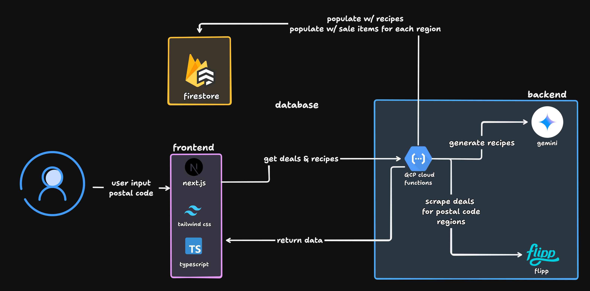

# MealMate

## Overview

MealMate is a budget-conscious recipe generator that helps users save money by creating meal plans based on local grocery deals. Born from the motivation to be frugal and make the most of every dollar, it transforms weekly flyer discounts into practical, cost-effective recipes. Simply enter your postal code and let MealMate do the work of finding deals and suggesting what to cook.

<!-- Main page screenshot -->


## Technical Information

MealMate uses a React frontend that sends postal-code–based requests to a GCP Cloud Function, which handles all backend logic including deal aggregation, caching, and AI orchestration. The Cloud Function scrapes localized grocery deals, stores and reuses them in Firestore, and generates budget-optimized recipes via Gemini only when needed. The combined deals and recipes are then returned as a single response for efficient client-side rendering.



## Project Structure

The project is divided into two main components:

### 1. Frontend (`/frontend`)
- **Technology**: Next.js 14+ (App Router), TypeScript, Tailwind CSS, Shadcn UI, Framer Motion.
- **Purpose**: Provides a responsive, modern UI for users to input their location and view deals/recipes.
- **Key Directories**:
  - `src/app`: Page routes and layouts.
  - `src/components/ui`: Reusable UI components (Shadcn).
  - `src/lib`: Utilities.

### 2. Backend API (`/api`)
- **Technology**: FastAPI, Python, Google Cloud (Firestore, Functions, Gemini).
- **Purpose**: Handles deal aggregation, caching, and AI logic.
- **Key Files**:
  - `main.py`: Entry point for the API.
  - `functions_framework`: (Optional) For Cloud Function compatibility.
  - `services/`: Placeholder for Deals logic and AI providers.

### Running the Frontend
```bash
cd frontend
npm install
npm run dev
# Front end will be available at http://localhost:3000
```

### Running the Backend
```bash
cd api
python3 -m venv venv
source venv/bin/activate
pip install -r requirements.txt
uvicorn main:app --reload
# API will be available at http://localhost:8000
# Documentation at http://localhost:8000/docs
```


